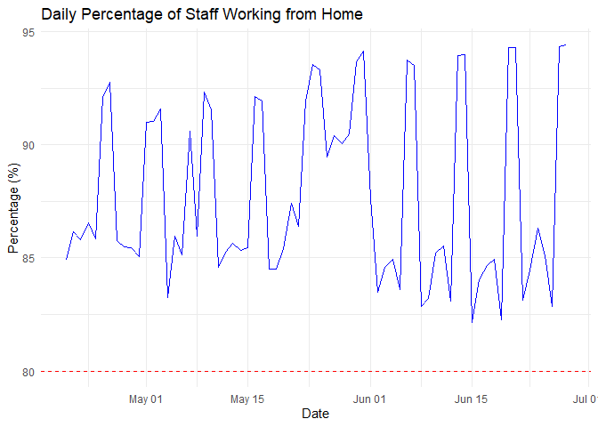
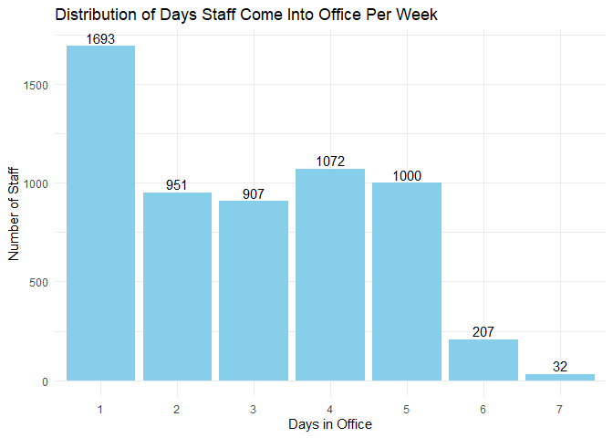
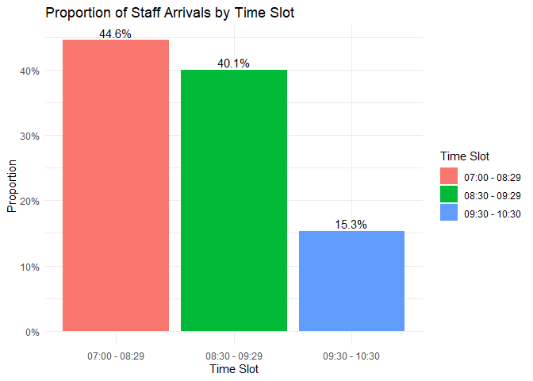
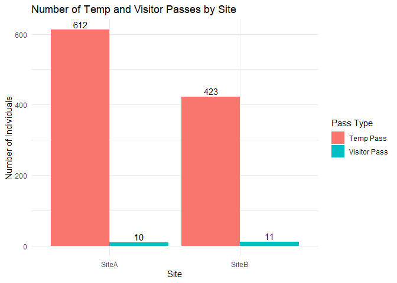

Data Quality Management and Staff Dashboard Visualisation
================
Ou Yang Yu
2024-09-19

# Introduction

This is a data analysis assessment assigned to me for a job position
with a Singapore public agency.

Company ABC has supplied 22 datasets containing the following variables:
When, Profile, Dept, and CardNum. Each record represents a staff member
tapping their access pass at the building’s entry system at a specific
time.

This Rmd is divided into two parts: the first addresses data quality
issues, while the second focuses on dashboard visualisation.

This script processes and organizes the raw CSV data in the Access_data
folder to make it suitable for analysis. It identifies and resolves data
quality issues in the raw data. The code is designed to allow users to
run it to ingest additional datasets of different periods beyond the
given sample.

## Load Libraries

I start by loading the necessary libraries.

``` r
library(tidyverse)
#library(dplyr)
#library(readr)
#library(stringr)
library(lubridate)
#library(purrr)
#library(ggplot2)
library(flexdashboard)
library(plotly)
```

## Define Data Directory

Set the path to the data directory.

``` r
data_dir <- "Access_data"
```

## List and Check CSV Files

First, I list all CSV files in the directory and perform checks to
ensure they have the correct structure.

``` r
# Expected column names
expected_columns <- c("When", "Profile", "Dept", "CardNum")

# Get list of all CSV files in the data directory
file_list <- list.files(path = data_dir, pattern = "\\.csv$", full.names = TRUE)

# Initialize list to collect files that pass the checks
valid_files <- c()

# Initialize a list to store data frames with corrected column names
corrected_data_list <- list()

# Perform checks on each file
for (filename in file_list) {
  # Read the CSV file with all columns as character
  data <- read_csv(filename, col_types = cols(.default = "c"))
  
  # Flag to indicate if file is valid
  is_valid <- TRUE
  
  # Check if the number of columns is exactly 4
  if(ncol(data) != 4) {
    cat("Issue found in file:", basename(filename), "- Expected 4 columns, found", ncol(data), "\n")
    is_valid <- FALSE
  }
  
  # Check if column names match the expected names
  if(!all(names(data) == expected_columns)) {
    cat("Issue found in file:", basename(filename), "- Column names do not match expected names.\n")
    cat("Expected:", paste(expected_columns, collapse = ", "), "\n")
    cat("Found:", paste(names(data), collapse = ", "), "\n")
    
    # Attempt to correct column names if possible
    corrected_names <- names(data)
    corrected_names <- str_replace(corrected_names, "^Depts$", "Dept")
    names(data) <- corrected_names
    
    # Re-check if column names now match expected names
    if(!all(names(data) == expected_columns)) {
      is_valid <- FALSE
    } else {
      cat("Column names corrected for file:", basename(filename), "\n")
    }
  }
  
  if(is_valid) {
    # Add to list of valid files
    valid_files <- c(valid_files, filename)
    
    # Add the data to the list
    corrected_data_list[[filename]] <- data
  }
}
```

    ## Issue found in file: SiteA20200622-20200628a.csv - Column names do not match expected names.
    ## Expected: When, Profile, Dept, CardNum 
    ## Found: When, Profile, Depts, CardNum 
    ## Column names corrected for file: SiteA20200622-20200628a.csv

Interpretation:

- The csv file, SiteA20200622-20200628a.csv has 1 column named Depts,
  which is different from all other csv files’ Dept column.

## Read CSV Files and Create ‘Site’ Column

Next, I read the valid CSV files, create the Site column based on the
filename, and check for any issues.

``` r
# Combine the corrected data frames into one data frame
access_data <- bind_rows(corrected_data_list, .id = "filename")

# Extract filename without path
access_data <- access_data %>%
  mutate(filename = basename(filename))

# Create 'Site' column based on filename prefix
access_data <- access_data %>%
  mutate(Site = case_when(
    str_starts(filename, "SiteA") ~ "SiteA",
    str_starts(filename, "SiteB") ~ "SiteB",
    TRUE ~ NA_character_
  ))

# Check for any NAs in 'Site' column
site_issues <- access_data %>% filter(is.na(Site))
if(nrow(site_issues) > 0) {
  cat("Issues found in 'Site' column. The following filenames could not be assigned a Site:\n")
  print(unique(site_issues$filename))
}
```

Interpretation:

- No Issues with reading the csv files.

# Data Quality Checks and Cleaning

### Check ‘When’ Column Format

Ensure that the When column values follow the format DD/M/YYYY H:MM

``` r
# Define the expected pattern for 'When' values
when_pattern <- "^\\d{1,2}/\\d{1,2}/\\d{4}\\s{1,2}\\d{1,2}:\\d{2}$"

# Identify entries that do not match the pattern or are NA
when_issues <- access_data %>% filter(!str_detect(When, when_pattern) | is.na(When))
if(nrow(when_issues) > 0) {
  issue_counts <- when_issues %>%
    group_by(When) %>%
    summarize(Count = n())
  print(issue_counts)
}

# Proceed to parse 'When' column
access_data <- access_data %>%
  mutate(When = dmy_hm(When))
```

Interpretation:

- No Issues with parsing ‘When’ column.

### Check ‘Profile’ Column Values

First, check that the values in the Profile column are only 0, 1, or 2.
If there are other values, print out the issues.

``` r
# Identify entries with values not 0, 1, or 2, or NA
valid_profiles <- c("0", "1", "2")
profile_issues <- access_data %>% filter(!Profile %in% valid_profiles | is.na(Profile))
if(nrow(profile_issues) > 0) {
  issue_counts <- profile_issues %>%
    group_by(Profile) %>%
    summarize(Count = n())
  print(issue_counts)
}
```

    ## # A tibble: 3 × 2
    ##   Profile      Count
    ##   <chr>        <int>
    ## 1 Staff Pass       1
    ## 2 Temp Pass        1
    ## 3 Visitor Pass     1

Interpretation:

- The Profile column contains 1 count of each Pass in character, aside
  from numeric 0, 1, 2. But there is no issues with the Pass’s names,
  thus I am ignoring it, as I am converting the numerics into characters
  in the next code.

### Ensure ‘Profile’ is Categorical

After checking, convert 0, 1, and 2 to “Staff Pass”, “Temp Pass”,
“Visitor Pass” respectively.

``` r
# Convert valid 'Profile' values to descriptive labels using case_when
access_data <- access_data %>%
  mutate(Profile = case_when(
    Profile == "0" ~ "Staff Pass",
    Profile == "1" ~ "Temp Pass",
    Profile == "2" ~ "Visitor Pass",
    TRUE ~ Profile
  ))
```

### Check ‘Dept’ Column Format

Ensure that the Dept column values follow the format “Dept X” (e.g.,
“Dept 4”, “Dept 16”). Also, check for NA values and print out issues
with counts.

``` r
# Define the expected pattern for 'Dept' values
dept_pattern <- "^Dept \\d+$"

# Identify entries that do not match the pattern or are NA
dept_issues <- access_data %>% filter(!str_detect(Dept, dept_pattern) | is.na(Dept))
if(nrow(dept_issues) > 0) {
  issue_counts <- dept_issues %>%
    group_by(Dept) %>%
    summarize(Count = n())
  print(issue_counts)
}
```

    ## # A tibble: 2 × 2
    ##   Dept    Count
    ##   <chr>   <int>
    ## 1 Dept  1     1
    ## 2 <NA>    19367

Interpretation:

- Dept column has 1 count of a Dept that has double spacing in between.
  And 19367 counts of NA. Which will be corrected in the next code.

### Remove Extra Spaces and Replace Missing Values in ‘Dept’ Values

After checking the ‘Dept’ column format, I remove extra spaces in ‘Dept’
values and change all NA to “Dept Unknown”.

``` r
# Remove extra spaces in 'Dept' values
access_data <- access_data %>%
  mutate(Dept = str_replace_all(Dept, "\\s+", " "))

# Replace NA values with 'Dept Unknown'
access_data <- access_data %>%
  mutate(Dept = ifelse(is.na(Dept) | Dept == "", "Dept Unknown", Dept))
```

### Verify ‘CardNum’ Contains Only Numeric Values

Check that the CardNum column contains only numeric digits and no spaces
or other characters. Report any issues found with counts.

``` r
# Define the pattern for numeric values
cardnum_pattern <- "^\\d+$"

# Identify entries that do not match the pattern or are NA
cardnum_issues <- access_data %>% filter(!str_detect(CardNum, cardnum_pattern) | is.na(CardNum))
if(nrow(cardnum_issues) > 0) {
  #cat("Issues found in 'CardNum' column. The following invalid entries and their counts are:\n")
  issue_counts <- cardnum_issues %>%
    group_by(CardNum) %>%
    summarize(Count = n())
  print(issue_counts)
}
```

    ## # A tibble: 5 × 2
    ##   CardNum Count
    ##   <chr>   <int>
    ## 1 #REF!     846
    ## 2 #VALUE!    18
    ## 3 40202!      1
    ## 4 9 42530     1
    ## 5 <NA>        5

Interpretation:

- CardNum column has 5 issues found, eg, \#REF!, \#VALUE!, 40202!, 9
  42530, NA. All will be corrected in the next code.

### Fix Specific Issues in ‘CardNum’ Column

After verifying ‘CardNum’, I address specific issues.

``` r
# Clean 'CardNum' by replacing invalid values with 'Unknown' and removing unnecessary characters
access_data <- access_data %>%
  mutate(CardNum = replace_na(CardNum, "Unknown"),           # Replace NA with 'Unknown'
         CardNum = if_else(CardNum %in% c("#REF!", "#VALUE!"), "Unknown", CardNum), # Replace specific invalid values
         CardNum = str_replace(CardNum, "^.*\\s+", ""),       # Remove text before space
         CardNum = str_replace_all(CardNum, "[^0-9]", ""))    # Remove non-numeric characters
```

### Handle ‘CardNum’ Leading Zeros

Ensure that CardNum has at least 8 characters by padding with leading
zeros.

``` r
# Pad 'CardNum' with leading zeros to ensure it has at least 8 characters
access_data <- access_data %>%
  mutate(CardNum = str_pad(CardNum, width = 8, side = "left", pad = "0"))
```

### Remove Duplicate Entries and Keep Earliest Entry per Day

A staff can tap their access pass multiple times on the same day.

For each staff, keep only the earliest entry per day, which subsequent
analysis will be based on.

``` r
# Remove duplicates and keep the earliest entry per day
access_data <- access_data %>%
  group_by(CardNum, date = as_date(When)) %>%
  arrange(When) %>%
  slice(1) %>%
  ungroup()
```

### Check for Missing Values

Summarize missing values to identify any issues.

``` r
# Summarize missing values
missing_summary <- access_data %>%
  summarise_all(~ sum(is.na(.)))

print(missing_summary)
```

    ## # A tibble: 1 × 7
    ##   filename  When Profile  Dept CardNum  Site  date
    ##      <int> <int>   <int> <int>   <int> <int> <int>
    ## 1        0     0       0     0       0     0     0

Interpretation:

- No missing values are found in all columns.

### Handle Missing or Invalid Data

Since I have replaced missing or invalid data in ‘Dept’ and ‘CardNum’, I
no longer need to remove rows based on those columns. I can proceed with
the data.

However, I might still want to remove rows with missing ‘When’,
‘Profile’, or ‘Site’, or resolve them before reaching this stage, if
there are more files added in the future.

``` r
# Remove rows with missing 'When', 'Profile', or 'Site'
access_data_clean <- access_data %>%
  filter(!is.na(When)) %>%
  filter(!is.na(Profile)) %>%
  filter(!is.na(Site)) %>%
  select(-filename)
```

## Final Data Ready for Analysis

``` r
head(access_data_clean)
```

    ## # A tibble: 6 × 6
    ##   When                Profile   Dept         CardNum  Site  date      
    ##   <dttm>              <chr>     <chr>        <chr>    <chr> <date>    
    ## 1 2020-04-20 07:00:00 Temp Pass Dept Unknown 00000000 SiteB 2020-04-20
    ## 2 2020-04-21 07:00:00 Temp Pass Dept Unknown 00000000 SiteB 2020-04-21
    ## 3 2020-04-22 07:02:00 Temp Pass Dept Unknown 00000000 SiteB 2020-04-22
    ## 4 2020-04-23 07:00:00 Temp Pass Dept Unknown 00000000 SiteB 2020-04-23
    ## 5 2020-04-24 07:00:00 Temp Pass Dept Unknown 00000000 SiteB 2020-04-24
    ## 6 2020-04-25 07:03:00 Temp Pass Dept Unknown 00000000 SiteB 2020-04-25

``` r
#write.csv(access_data_clean, file="access_data_clean.csv", row.names = FALSE)
```

# Access Data Dashboard

# Introduction

This dashboard provides insights into the company’s access data to help
end-users make informed decisions on a regular basis. It addresses the
following key areas:

- Target Staff Working from Home: Monitoring the percentage of staff
  working from home to ensure it exceeds 80%.

- Staff Attendance Patterns: Analyzing the number of days per week staff
  come into the office and their arrival time slots to stagger work
  hours effectively.

- Temp and Visitor Pass Usage: Tracking the number of individuals issued
  with Temp or Visitor Pass at each office site.

## Staff Working from Home

### Daily Percentage of Staff Working from Home

I calculate the daily percentage of staff working from home based on the
number of unique staff accessing the office each day.

The blue line represents the daily percentage of staff working from
home.

The red dashed line indicates the company’s target of 80%.

The company aims to keep the blue line above the red line.

``` r
# Total number of staff
total_staff <- 2000

# Calculate daily staff attendance
daily_attendance <- access_data_clean %>%
  filter(Profile == "Staff Pass") %>%
  mutate(Date = as.Date(When)) %>%
  group_by(Date) %>%
  summarise(Staff_In_Office = n_distinct(CardNum)) %>%
  mutate(
    Staff_Working_From_Home = total_staff - Staff_In_Office,
    Percentage_WFH = (Staff_Working_From_Home / total_staff) * 100
  )

# Plot the percentage of staff working from home
p1 <- ggplot(daily_attendance, aes(x = Date, y = Percentage_WFH)) +
  geom_line(color = "blue") +
  geom_hline(yintercept = 80, linetype = "dashed", color = "red") +
  labs(title = "Daily Percentage of Staff Working from Home",
       y = "Percentage (%)",
       x = "Date") +
  theme_minimal()

#ggplotly(p1)
p1
```

<!-- -->

Interpretation:

- More than 80% of the staff in the company are already working from
  home each day.

## Staff Attendance Patterns

### Number of Days Staff Come In Per Week

I analyze how many days per week staff are coming into the office.

The histogram shows how many staff come in 1, 2, …, 7 days per week.

This helps in understanding staff attendance patterns for better
scheduling.

``` r
# Extract week number
attendance_per_week <- access_data_clean %>%
  filter(Profile == "Staff Pass") %>%
  mutate(Week = isoweek(When), CardNum = as.factor(CardNum)) %>%
  group_by(Week, CardNum) %>%
  summarise(Days_In_Office = n_distinct(as.Date(When))) %>%
  ungroup()

# Calculate counts for each number of days
days_count <- attendance_per_week %>%
  group_by(Days_In_Office) %>%
  summarise(Count = n())

# Plot histogram of days per week with labels above bars
p2 <- ggplot(days_count, aes(x = as.factor(Days_In_Office), y = Count)) +
  geom_bar(stat = "identity", fill = "skyblue") +
  geom_text(aes(label = Count), vjust = -0.3) +
  scale_x_discrete(name = "Days in Office") +
  labs(title = "Distribution of Days Staff Come Into Office Per Week",
       x = "Days in Office",
       y = "Number of Staff") +
  theme_minimal()

#ggplotly(p2)
p2
```

<!-- -->

Interpretation:

- Most staff only come into office once or up to 5 days a week, which
  some outliers coming in 6 to 7 days a week. Company may want to check
  why these outliers are coming in to office so frequently.

### Arrival Time Slots Distribution

I examine the distribution of staff arrivals across the three time
slots.

The bar chart shows the proportion of staff arriving in each time slot.

The company aims for approximately 1/3 in each slot.

``` r
# Define time slots
access_data_clean <- access_data_clean %>%
  mutate(Time_Slot = case_when(
    format(When, "%H:%M:%S") >= "07:00:00" & format(When, "%H:%M:%S") <= "08:29:59" ~ "07:00 - 08:29",
    format(When, "%H:%M:%S") >= "08:30:00" & format(When, "%H:%M:%S") <= "09:29:59" ~ "08:30 - 09:29",
    format(When, "%H:%M:%S") >= "09:30:00" & format(When, "%H:%M:%S") <= "10:30:00" ~ "09:30 - 10:30",
    TRUE ~ "Other"
  ))

# Filter only the defined time slots
time_slot_data <- access_data_clean %>%
  filter(Profile == "Staff Pass", Time_Slot != "Other")

# Calculate proportion per time slot
time_slot_distribution <- time_slot_data %>%
  group_by(Time_Slot) %>%
  summarise(Count = n()) %>%
  mutate(Proportion = Count / sum(Count))

# Plot the time slot distribution with percentage labels
p3 <- ggplot(time_slot_distribution, aes(x = Time_Slot, y = Proportion, fill = Time_Slot)) +
  geom_bar(stat = "identity") +
  geom_text(aes(label = scales::percent(Proportion, accuracy = 0.1)), vjust = -0.3) +
  scale_y_continuous(labels = scales::percent) +
  labs(title = "Proportion of Staff Arrivals by Time Slot",
       x = "Time Slot",
       y = "Proportion",
       fill = "Time Slot") +
  theme_minimal()

#ggplotly(p3)
p3
```

<!-- -->

Interpretation:

- Most staff arrive in office from 7am to 9.29am. 15.3% of the staff
  come into office from 9.30am to 10.30am. Company may want to check why
  they are coming after 9.30am, and consider offering incentives to
  nudge staff to come in at that timing.

## Temp and Visitor Pass Usage

### Number of Temp and Visitor Passes by Site

I track the number of individuals issued with Temp or Visitor Pass at
each office site.

The bar chart shows the number of Temp and Visitor Pass holders at each
site.

This helps in managing site access and security.

``` r
# Filter Temp and Visitor Passes
temp_visitor_data <- access_data_clean %>%
  filter(Profile %in% c("Temp Pass", "Visitor Pass"))

# Count by Site and Profile
pass_counts <- temp_visitor_data %>%
  group_by(Site, Profile) %>%
  summarise(Count = n_distinct(CardNum)) %>%
  ungroup()

# Plot the counts with labels
p4 <- ggplot(pass_counts, aes(x = Site, y = Count, fill = Profile)) +
  geom_bar(stat = "identity", position = "dodge") +
  geom_text(aes(label = Count), position = position_dodge(width = 0.9), vjust = -0.3) +
  labs(title = "Number of Temp and Visitor Passes by Site",
       x = "Site",
       y = "Number of Individuals",
       fill = "Pass Type") +
  theme_minimal()

#ggplotly(p4)
p4
```

<!-- -->

Interpretation:

- There are more temp passes issues at Site A.

## Conclusion

This dashboard provides actionable insights into staff attendance and
access patterns. By regularly monitoring these metrics, the company can:

- Ensure that more than 80% of staff are working from home.

- Adjust work schedules to maintain an even distribution of staff
  arrivals across defined time slots.

- Manage and monitor the issuance of Temp and Visitor Passes for
  security purposes.
