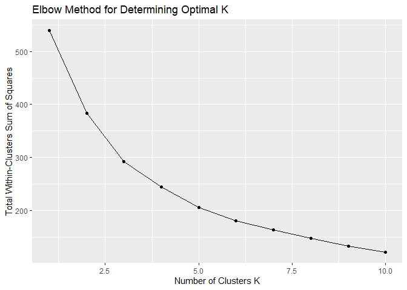
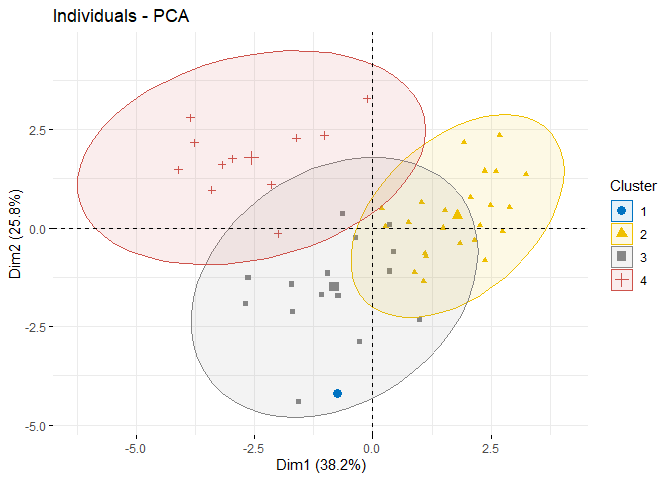
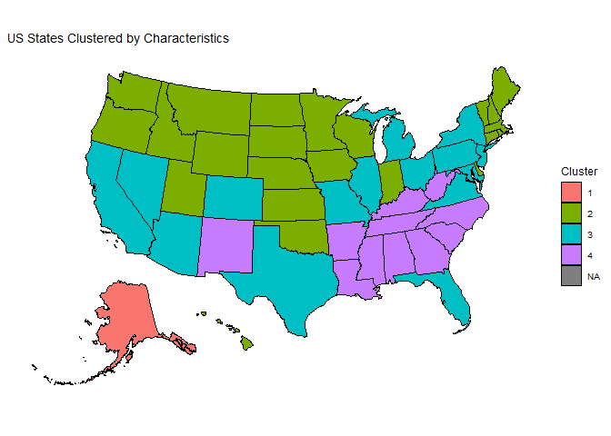
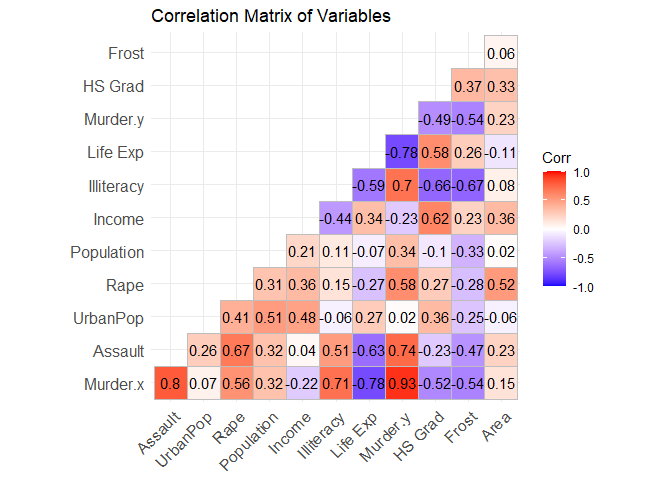
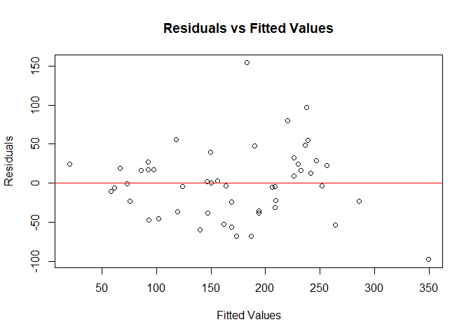
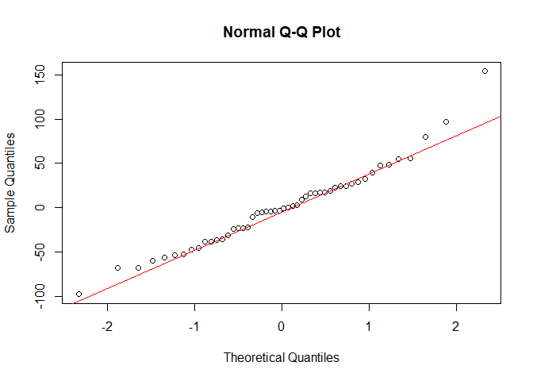

US States Grouping and Assault Rate Prediction
================
Ou Yang Yu
2024-09-20

# Introduction

This data analysis assessment was assigned as part of a job application
with a Singapore public agency.

The assessment includes 8 datasets and 3 data dictionaries that may be
utilised for analysis.

The analysis is divided into two sections:

- The first section involves categorizing US states based on their
  characteristics.

- The second section focuses on identifying statistically significant
  factors that can predict Assault rates.

## Categorise / group the states based on their characteristics

In this analysis, I aim to categorize or group the US states based on
their characteristics. I will utilise the provided datasets to perform
clustering analysis, which will help us identify patterns and group
similar states together.

## Load Libraries

Loading libraries for data manipulation, visualisation, and clustering.

``` r
library(tidyverse)
library(cluster)
library(factoextra)
library(broom)       # For tidying model outputs
library(car)         # For variance inflation factor
library(ggcorrplot)  # For correlation plots
```

## Reading and Preparing the Data

Read these datasets and merge them to create a dataset for analysis.

The reason for choosing USArrest.csv and USstatex77.csv is because they
contain numerical variables that are directly relevant to the goal of
categorising states based on socio-economic characteristics and crime
rates. Clustering analysis requires numerical variables that quantify
state characteristics. Categorical variables in other csv datasets could
bias the clustering results towards existing classifications.

``` r
# Read the necessary datasets from the US_Arrest_Data folder
USArrest <- read_csv("US_Arrest_Data/USArrest.csv")
USstatex77 <- read_csv("US_Arrest_Data/USstatex77.csv")
```

## Data Preparation

Clean and merge relevant datasets to create a comprehensive dataset for
clustering.

``` r
# Ensure the 'State' column is present for merging
colnames(USArrest)[1] <- "State"
colnames(USstatex77)[1] <- "State"

# Merge USArrest and USstatex77 datasets
state_data <- inner_join(USArrest, USstatex77, by = "State")

# View the first few rows
head(state_data)
```

    ## # A tibble: 6 × 13
    ##   State  Murder.x Assault UrbanPop  Rape Population Income Illiteracy `Life Exp`
    ##   <chr>     <dbl>   <dbl>    <dbl> <dbl>      <dbl>  <dbl>      <dbl>      <dbl>
    ## 1 Alaba…     13.2     236       58  21.2       3615   3624        2.1       69.0
    ## 2 Alaska     10       263       48  44.5        365   6315        1.5       69.3
    ## 3 Arizo…      8.1     294       80  31         2212   4530        1.8       70.6
    ## 4 Arkan…      8.8     190       50  19.5       2110   3378        1.9       70.7
    ## 5 Calif…      9       276       91  40.6      21198   5114        1.1       71.7
    ## 6 Color…      7.9     204       78  38.7       2541   4884        0.7       72.1
    ## # ℹ 4 more variables: Murder.y <dbl>, `HS Grad` <dbl>, Frost <dbl>, Area <dbl>

## Data Cleaning and Selection

Select the relevant numeric variables for clustering and handle any
missing data.

``` r
# Select numeric variables
numeric_vars <- state_data %>%
  select(Murder.x, Assault, UrbanPop, Rape, Population, Income, Illiteracy, `Life Exp`, `HS Grad`, Frost, Area)

# Check for missing values
sum(is.na(numeric_vars))
```

    ## [1] 0

## Data Normalisation

Normalise the data to ensure all variables contribute equally to the
analysis.

``` r
# Scale the numeric variables
numeric_vars_scaled <- scale(numeric_vars)
```

## Clustering Analysis

### Determining the Optimal Number of Clusters

Use the Elbow method to find the optimal number of clusters for K-means
clustering.

``` r
# Calculate total within-cluster sum of squares
set.seed(123)
wss <- map_dbl(1:10, function(k){
  kmeans(numeric_vars_scaled, centers = k, nstart = 10)$tot.withinss
})

# Plot the Elbow method graph
qplot(1:10, wss, geom = "line") +
  geom_point() +
  xlab("Number of Clusters K") +
  ylab("Total Within-Clusters Sum of Squares") +
  ggtitle("Elbow Method for Determining Optimal K")
```

<!-- -->

### K-means Clustering

Based on the Elbow method, choose the optimal number of clusters, k = 4.

``` r
set.seed(123)
k <- 4  # Optimal number of clusters
km_res <- kmeans(numeric_vars_scaled, centers = k, nstart = 25)

# Add cluster assignments to the data
state_data <- state_data %>%
  mutate(Cluster = factor(km_res$cluster))
```

## Visualisation

### Cluster Visualisation

Visualise the clusters using Principal Component Analysis (PCA).

``` r
# Perform PCA
pca_res <- prcomp(numeric_vars_scaled)

# Plot PCA with clusters
fviz_pca_ind(pca_res,
             geom.ind = "point",
             col.ind = state_data$Cluster,
             palette = "jco",
             addEllipses = TRUE,
             legend.title = "Cluster")
```

<!-- -->

### Cluster Profiles

Examine the characteristics of each cluster.

``` r
# Calculate mean of variables by cluster
cluster_profiles <- numeric_vars %>%
  mutate(Cluster = state_data$Cluster) %>%
  group_by(Cluster) %>%
  summarise(across(everything(), mean))

# View cluster profiles
print(cluster_profiles)
```

    ## # A tibble: 4 × 12
    ##   Cluster Murder.x Assault UrbanPop  Rape Population Income Illiteracy
    ##   <fct>      <dbl>   <dbl>    <dbl> <dbl>      <dbl>  <dbl>      <dbl>
    ## 1 1          10       263      48    44.5       365   6315       1.5  
    ## 2 2           4.02    109.     63.9  15.5      2050.  4502.      0.783
    ## 3 3           9.91    223.     77.9  28.7      8616.  4796.      1.12 
    ## 4 4          12.6     220.     53.7  20.8      3233   3636.      2.02 
    ## # ℹ 4 more variables: `Life Exp` <dbl>, `HS Grad` <dbl>, Frost <dbl>,
    ## #   Area <dbl>

## Identify States in Each Cluster

To better understand these clusters, I find out which states belong to
each cluster.

``` r
# List states per cluster
states_in_clusters <- state_data %>%
  select(State, Cluster) %>%
  arrange(Cluster)

print(states_in_clusters)
```

    ## # A tibble: 50 × 2
    ##    State         Cluster
    ##    <chr>         <fct>  
    ##  1 Alaska        1      
    ##  2 Connecticut   2      
    ##  3 Delaware      2      
    ##  4 Hawaii        2      
    ##  5 Idaho         2      
    ##  6 Indiana       2      
    ##  7 Iowa          2      
    ##  8 Kansas        2      
    ##  9 Maine         2      
    ## 10 Massachusetts 2      
    ## # ℹ 40 more rows

``` r
#write_csv(states_in_clusters, "states_in_clusters.csv")
```

## Geographical Mapping

Plot the clusters on a map.

``` r
library(usmap)
library(dplyr)

# Ensure state names match with state_data
state_data_map <- state_data %>%
  mutate(state = State)  # Ensure the column is named 'state'

# Plot the clusters on the US map
plot_usmap(data = state_data_map, values = "Cluster", regions = "states") +
  scale_fill_discrete(name = "Cluster") +
  labs(title = "US States Clustered by Characteristics") +
  theme(legend.position = "right")
```

<!-- -->

## Summarizing the Clusters

Cluster 1: High Crime, High Income, Low Urbanisation States

- Included: Alaska

- Characteristics:

  - High crime rates despite high income levels: Highest average values
    for Murder, Assault, and Rape rates. Highest average income among
    clusters.

  - Low urban population percentages: Relatively low at 48%, suggesting
    more rural areas.

  - Large areas: Larger average area than other clusters

  - Colder climates: Highest average number of frost days

- Possible Reasons: Sparse law enforcement coverage, resource-based
  economies, remote locations.

Cluster 2: Low Crime, High Education, Moderate Urbanisation States

- Included: Midwestern or Northern states like Minnesota, Iowa, and
  others, Connecticut, Delaware, Hawaii, Idaho, Indiana, Kansas, Maine,
  Massachusetts, Montana, Nebraska, New Hampshire, North Dakota,
  Oklahoma, Oregon, Rhode Island, South Dakota, Utah, Vermont,
  Washington, Wisconsin, Wyoming

- Characteristics:

  - Low crime rates: Lowest average values for Murder, Assault, and Rape
    rates

  - High education levels: Highest HS Grad rates and lowest average
    illiteracy rate.

  - Higher life expectancy: Highest Life Exp.

  - Moderate income

- Possible Reasons: Strong education systems, community cohesion,
  effective social policies.

Cluster 3: High Population, Urban States States

- Included: Arizona, California, Colorado, Florida, Illinois, Maryland,
  Michigan, Missouri, Nevada, New Jersey, New York, Ohio, Pennsylvania,
  Texas, Virginia

- Characteristics:

  - High urban populations: Highest percentage of urban population.

  - Higher crime rates associated with urban areas: High averages for
    Murder and Assault rates.

  - Large populations: Highest population size

- Possible Reasons: Urban challenges like congestion, socio-economic
  disparities, higher cost of living.

Cluster 4: High Crime, Low Income, Low Education States

- Included: Southern states like Mississippi, Louisiana, and others,
  Alabama, Arkansas, Georgia, Kentucky, New Mexico, North Carolina,
  South Carolina, Tennessee, West Virginia

- Characteristics:

  - Highest murder rates: Even higher than Cluster 1.

  - Low income: Lowest average income.

  - Low education levels: Lowest average HS Grad rates, highest
    illiteracy rate.

  - Warmer climates: Lowest average number of frost days.

- Possible Reasons: Historical socio-economic challenges, systemic
  issues, lack of access to quality education and healthcare.

# What factors are statistically significant in predicting Assault rates?

In this section, I aim to identify the factors that are statistically
significant in predicting Assault rates using the datasets provided.

## Data Preparation

I’ll prepare the data by merging the datasets.

``` r
# Merge datasets
assault_data <- inner_join(USArrest, USstatex77, by = "State")

# View the first few rows
head(assault_data)
```

    ## # A tibble: 6 × 13
    ##   State  Murder.x Assault UrbanPop  Rape Population Income Illiteracy `Life Exp`
    ##   <chr>     <dbl>   <dbl>    <dbl> <dbl>      <dbl>  <dbl>      <dbl>      <dbl>
    ## 1 Alaba…     13.2     236       58  21.2       3615   3624        2.1       69.0
    ## 2 Alaska     10       263       48  44.5        365   6315        1.5       69.3
    ## 3 Arizo…      8.1     294       80  31         2212   4530        1.8       70.6
    ## 4 Arkan…      8.8     190       50  19.5       2110   3378        1.9       70.7
    ## 5 Calif…      9       276       91  40.6      21198   5114        1.1       71.7
    ## 6 Color…      7.9     204       78  38.7       2541   4884        0.7       72.1
    ## # ℹ 4 more variables: Murder.y <dbl>, `HS Grad` <dbl>, Frost <dbl>, Area <dbl>

## Exploring the Data

Before building the model, explore the data to understand the
relationships between variables.

### Summary Statistics

``` r
# Summary of the data
summary(assault_data)
```

    ##     State              Murder.x         Assault         UrbanPop    
    ##  Length:50          Min.   : 0.800   Min.   : 45.0   Min.   :32.00  
    ##  Class :character   1st Qu.: 4.075   1st Qu.:109.0   1st Qu.:54.50  
    ##  Mode  :character   Median : 7.250   Median :159.0   Median :66.00  
    ##                     Mean   : 7.788   Mean   :170.8   Mean   :65.54  
    ##                     3rd Qu.:11.250   3rd Qu.:249.0   3rd Qu.:77.75  
    ##                     Max.   :17.400   Max.   :337.0   Max.   :91.00  
    ##       Rape         Population        Income       Illiteracy       Life Exp    
    ##  Min.   : 7.30   Min.   :  365   Min.   :3098   Min.   :0.500   Min.   :67.96  
    ##  1st Qu.:15.07   1st Qu.: 1080   1st Qu.:3993   1st Qu.:0.625   1st Qu.:70.12  
    ##  Median :20.10   Median : 2838   Median :4519   Median :0.950   Median :70.67  
    ##  Mean   :21.23   Mean   : 4246   Mean   :4436   Mean   :1.170   Mean   :70.88  
    ##  3rd Qu.:26.18   3rd Qu.: 4968   3rd Qu.:4814   3rd Qu.:1.575   3rd Qu.:71.89  
    ##  Max.   :46.00   Max.   :21198   Max.   :6315   Max.   :2.800   Max.   :73.60  
    ##     Murder.y         HS Grad          Frost             Area       
    ##  Min.   : 1.400   Min.   :37.80   Min.   :  0.00   Min.   :  1049  
    ##  1st Qu.: 4.350   1st Qu.:48.05   1st Qu.: 66.25   1st Qu.: 36985  
    ##  Median : 6.850   Median :53.25   Median :114.50   Median : 54277  
    ##  Mean   : 7.378   Mean   :53.11   Mean   :104.46   Mean   : 70736  
    ##  3rd Qu.:10.675   3rd Qu.:59.15   3rd Qu.:139.75   3rd Qu.: 81163  
    ##  Max.   :15.100   Max.   :67.30   Max.   :188.00   Max.   :566432

### Correlation Matrix

The correlation matrix shows how each variable is linearly related to
the others.

High correlation between independent variables may indicate
multicollinearity, which can affect the regression model.

``` r
# Select numeric variables for correlation analysis
numeric_vars <- assault_data %>%
  select(-State)

# Compute correlation matrix
cor_matrix <- cor(numeric_vars)

# Plot the correlation matrix
ggcorrplot(cor_matrix, lab = TRUE, type = "lower",
           title = "Correlation Matrix of Variables")
```

<!-- -->

Highly Correlated Variables:

- Murder.x and Murder.y: Correlation = 0.93 (These are highly correlated
  and likely redundant)

- Murder.x and Assault: Correlation = 0.80 (These two variables are
  strongly correlated)

- Murder.x and Illiteracy: Correlation = 0.71 (Another strong
  correlation)

- Illiteracy and Murder.y: Correlation = 0.70 (Strong correlation)

Moderately Correlated Variables:

- Assault and Rape: Correlation = 0.66 (Moderate correlation)

- Assault and Murder.y: Correlation = 0.74 (High correlation)

- HS Grad and Income: Correlation = 0.62 (This is moderate but may still
  be manageable in a model.)

Variables with Lower Correlation:

- UrbanPop and other variables: Most correlations involving UrbanPop are
  relatively low (under 0.5), so it can be a good candidate to include
  without multicollinearity concerns.

- Life Exp and Population: Correlation = -0.07 (Low correlation. These
  variables might independently contribute to the model.)

## Building the Regression Model

I will build a multiple linear regression model with Assault as the
dependent variable and other variables as predictors.

Based on the correlation matrix, the selection of variables for the
regression model are:

- Murder.x (chose it over Murder.y)

- UrbanPop (low correlations, can provide unique information)

- Rape (moderate correlations, but not highly collinear with others)

- HS Grad (moderate correlation with Income, but could be useful)

- Life Exp (lower correlations with others)

### Initial Model

In regression analysis, the F-statistic tests the null hypothesis that
none of the independent variables in the model have any effect on the
dependent variable. The alternative hypothesis is that at least one of
the independent variables has a significant effect on the dependent
variable.

The summary output shows the coefficients, standard errors, t-values,
and p-values for each predictor.

Variables with p-values less than 0.05 are considered statistically
significant at the 5% significance level.

``` r
# Fit the initial regression model
model_initial <- lm(Assault ~ Murder.x + UrbanPop + Rape + `Life Exp`  + `HS Grad`,
                    data = assault_data)

# View the summary of the model
summary(model_initial)
```

    ## 
    ## Call:
    ## lm(formula = Assault ~ Murder.x + UrbanPop + Rape + `Life Exp` + 
    ##     `HS Grad`, data = assault_data)
    ## 
    ## Residuals:
    ##     Min      1Q  Median      3Q     Max 
    ## -82.035 -27.405  -0.391  17.679 131.546 
    ## 
    ## Coefficients:
    ##              Estimate Std. Error t value Pr(>|t|)  
    ## (Intercept) 1233.4007   635.3992   1.941   0.0587 .
    ## Murder.x       8.1854     4.0175   2.037   0.0476 *
    ## UrbanPop       1.1034     0.5586   1.975   0.0545 .
    ## Rape           2.3391     1.3950   1.677   0.1007  
    ## `Life Exp`   -17.7636     8.9330  -1.989   0.0530 .
    ## `HS Grad`      0.2013     1.5769   0.128   0.8990  
    ## ---
    ## Signif. codes:  0 '***' 0.001 '**' 0.01 '*' 0.05 '.' 0.1 ' ' 1
    ## 
    ## Residual standard error: 44.64 on 44 degrees of freedom
    ## Multiple R-squared:  0.7424, Adjusted R-squared:  0.7131 
    ## F-statistic: 25.36 on 5 and 44 DF,  p-value: 6.082e-12

Summary of Initial Regression Model:

- A p-value of 6.082e-12 is very close to zero, meaning the chance of
  this F-statistic happening by random chance is exceedingly small
  (about 0.0000000006%). This level of significance indicates very
  strong evidence that the model as a whole is statistically
  significant. And rejecting the null hypothesis and conclude that at
  least one of the predictors significantly influences the dependent
  variable (Assault).

- The variable “Murder.x” is a significant predictor of “Assault” at the
  5% level (p-value = 0.0476). For every unit increase in “Murder.x”,
  “Assault” increases by an estimated 8.19 units.

- “UrbanPop” and “Life Exp” are marginally significant (p-values near
  0.05). For every unit increase in “UrbanPop”, “Assault” increases by
  1.10 units. For every unit increase in life expectancy, “Assault”
  decreases by 17.76 units.

- “Rape” is not significant at the 5% level but might be considered at
  the 10% level. For every unit increase in “Rape”, “Assault” increases
  by 2.34 units.

- “HS Grad” is not significant.

## Checking for Multicollinearity

High multicollinearity can inflate the variance of coefficient
estimates.

A VIF value greater than 5 (or 10) indicates high multicollinearity.

Variables with high VIF may need to be removed or combined.

``` r
# Calculate Variance Inflation Factor (VIF)
vif_values <- vif(model_initial)
print(vif_values)
```

    ##   Murder.x   UrbanPop       Rape `Life Exp`  `HS Grad` 
    ##   7.528949   1.607649   4.198246   3.535941   3.988746

VIF Result:

- Murder.x has a high VIF (7.53), indicating that it’s causing
  significant multicollinearity in the model. I am removing it,
  especially since it’s highly correlated with other variables like
  Murder.y and Assault.

- The other variables (UrbanPop, Rape, Life Exp, HS Grad) have
  acceptable VIFs and can remain in the model.

## Refining the Model

Based on the initial model and VIF values, I’ll refine the model by
removing variables that are not significant or cause multicollinearity.

``` r
# Remove variables with high VIF or insignificant p-values
model_refined <- lm(Assault ~ UrbanPop + Rape + `Life Exp` + `HS Grad`,
                    data = assault_data)

# View the summary of the refined model
summary(model_refined)
```

    ## 
    ## Call:
    ## lm(formula = Assault ~ UrbanPop + Rape + `Life Exp` + `HS Grad`, 
    ##     data = assault_data)
    ## 
    ## Residuals:
    ##     Min      1Q  Median      3Q     Max 
    ## -77.327 -28.731  -0.705  19.497 142.596 
    ## 
    ## Coefficients:
    ##              Estimate Std. Error t value Pr(>|t|)    
    ## (Intercept) 2062.6711   504.7223   4.087 0.000178 ***
    ## UrbanPop       1.4138     0.5559   2.543 0.014491 *  
    ## Rape           4.4056     0.9908   4.446 5.66e-05 ***
    ## `Life Exp`   -27.8401     7.6951  -3.618 0.000748 ***
    ## `HS Grad`     -1.9742     1.2003  -1.645 0.106969    
    ## ---
    ## Signif. codes:  0 '***' 0.001 '**' 0.01 '*' 0.05 '.' 0.1 ' ' 1
    ## 
    ## Residual standard error: 46.18 on 45 degrees of freedom
    ## Multiple R-squared:  0.718,  Adjusted R-squared:  0.693 
    ## F-statistic: 28.65 on 4 and 45 DF,  p-value: 7.3e-12

Summary of Refined Regression Model:

- The model remains statistically significant overall.

- UrbanPop, Rape, and Life Exp are significant predictors of “Assault.”

- HS Grad has a negative coefficient, indicating a possible inverse
  relationship with “Assault,” but it is not statistically significant
  in this model.

## Final Model

After further refinement, I arrive at the final model.

The final model includes only variables that are statistically
significant predictors of Assault, thus removed ‘HS Grad’ variable.

Coefficients indicate the direction and magnitude of the relationship
between predictors and Assault.

``` r
# Final model after removing non-significant variables
model_final <- lm(Assault ~ UrbanPop + Rape + `Life Exp`,
                  data = assault_data)

# View the summary of the final model
summary(model_final)
```

    ## 
    ## Call:
    ## lm(formula = Assault ~ UrbanPop + Rape + `Life Exp`, data = assault_data)
    ## 
    ## Residuals:
    ##     Min      1Q  Median      3Q     Max 
    ## -97.406 -34.181  -1.929  23.810 153.737 
    ## 
    ## Coefficients:
    ##              Estimate Std. Error t value Pr(>|t|)    
    ## (Intercept) 2579.3256   402.3309   6.411 6.99e-08 ***
    ## UrbanPop       1.4512     0.5657   2.565 0.013629 *  
    ## Rape           3.5902     0.8737   4.109 0.000162 ***
    ## `Life Exp`   -36.3989     5.7733  -6.305 1.01e-07 ***
    ## ---
    ## Signif. codes:  0 '***' 0.001 '**' 0.01 '*' 0.05 '.' 0.1 ' ' 1
    ## 
    ## Residual standard error: 47.02 on 46 degrees of freedom
    ## Multiple R-squared:  0.7011, Adjusted R-squared:  0.6816 
    ## F-statistic: 35.97 on 3 and 46 DF,  p-value: 4.02e-12

Summary of Final Regression Model:

- HS Grad was not a significant predictor in the previous model, and its
  removal has not significantly weakened the explanatory power of the
  model (R-squared dropped slightly).

- The significance of the remaining predictors (UrbanPop, Rape, and Life
  Exp) has been maintained, with Life Exp becoming an even stronger
  predictor.

- The Residual Standard Error has increased slightly, indicating a
  marginal decrease in the model’s predictive accuracy after removing HS
  Grad.

- Overall, the model is still very strong and significant, but the
  slight decline in R-squared and the increase in residual standard
  error suggest that HS Grad might have contributed some predictive
  value, even if it wasn’t statistically significant.

## Checking for Multicollinearity Again

``` r
# Calculate VIF for the final model
vif_final <- vif(model_final)
print(vif_final)
```

    ##   UrbanPop       Rape `Life Exp` 
    ##   1.485556   1.483909   1.330911

VIF Result:

- UrbanPop, Rape and Life Exp have VIF values below 5, indicating
  acceptable multicollinearity.

## Model Diagnostics

### Residual Analysis

I need to check if the model meets the assumptions of linear regression.

``` r
# Plot residuals vs fitted values
plot(model_final$fitted.values, model_final$residuals,
     xlab = "Fitted Values", ylab = "Residuals",
     main = "Residuals vs Fitted Values")
abline(h = 0, col = "red")
```

<!-- -->

``` r
# Normal Q-Q plot
qqnorm(model_final$residuals)
qqline(model_final$residuals, col = "red")
```

<!-- -->

Residual Analysis Result:

- Residuals vs Fitted Plot: Points are randomly scattered around zero
  without any clear patterns, suggests that the model fits the data
  well, with no obvious signs of heteroscedasticity or non-linearity.

- Normal Q-Q Plot: Points roughly fall along the diagonal line, suggest
  residuals are largely normally distributed, supports the assumption of
  normality.

## Interpreting the Model Coefficients

``` r
# Tidy the model output for easier interpretation
tidy_model <- tidy(model_final)
print(tidy_model)
```

    ## # A tibble: 4 × 5
    ##   term        estimate std.error statistic      p.value
    ##   <chr>          <dbl>     <dbl>     <dbl>        <dbl>
    ## 1 (Intercept)  2579.     402.         6.41 0.0000000699
    ## 2 UrbanPop        1.45     0.566      2.57 0.0136      
    ## 3 Rape            3.59     0.874      4.11 0.000162    
    ## 4 `Life Exp`    -36.4      5.77      -6.30 0.000000101

# Conclusion

I have identified that Urban Population percentage, Rape rate, Life
Expectancy are statistically significant factors in predicting Assault
rates among US states. These findings suggest that areas with higher
rape rates and urban populations, as well as low life expectancy tend to
have higher assault rates.

- An increase in the rate of rape is associated with an increase in the
  assault rate. Every unit increase in the rape rate, the assault rate
  is predicted to increase by 3.59 units.

- Higher urban population percentages tend to have higher assault rates.
  Every increase in the urban population, the assault rate increases by
  1.45 units.

- Lower life expectancy tend to have higher assault rates. For every
  one-year decrease in life expectancy, the assault rate is predicted to
  increase by 36.40 units.
